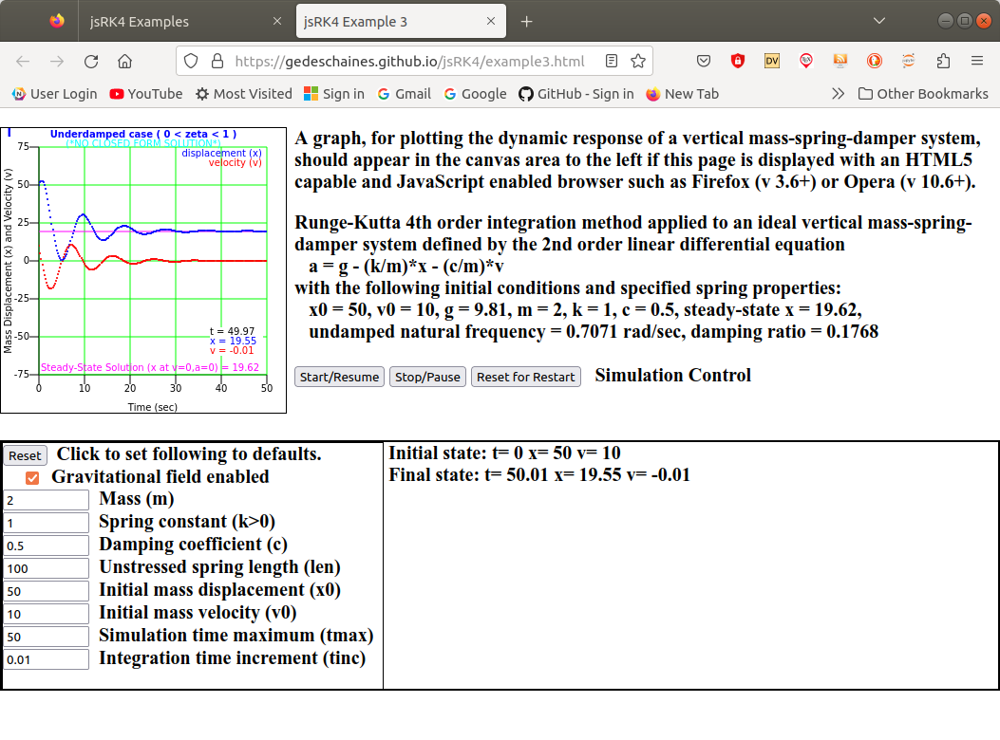

# jsRK4 #
___
A JavaScript/HTML5 implementation of explicit 4th order Runge-Kutta method to simulate mass-spring-damper system dynamics.

The four example HTML5 files presented in the [./docs](./docs) folder utilize an explicit fourth order Runge-Kutta (RK4) integration method applied to an ideal vertical mass-spring-damper system defined by the following second order linear differential equation.

     a = g - (k/m)*x - (c/m)*v                                                      (1)

Each example may be run by clicking on it's corresponding link in this [web page](https://gedeschaines.github.io/jsRK4/).
The following image depicts completed jsRK4 Example 3 run in FireFox browser.
___
 

  
 

## Background ##

With the growth in HTML5 support by most browser vendors by 2010, developing interactive dynamic web pages with animation became an inexpensive, practical and worth while endeavor. The capability to perform strictly client-side animated graphics without having to overcome HTML 4 and XHTML 1.0 limitations greatly simplified creation of Dynamic HTML [DHTML](https://en.wikipedia.org/wiki/Dynamic_HTML) web page content. The most significant enhancement for producing client-side animated graphics was the introduction of a canvas element to the Document Object Model [DOM](https://en.wikipedia.org/wiki/Document_Object_Model). An [HTML <canvas\> element](https://www.w3schools.com/html/html5_canvas.asp) provides the context in which to draw and display graphics on a web page. 

Having developed numerous 2D and 3D graphics applications to generate runtime and post-processing display of simulation output, ranging from battle field dynamics to 6-DOF missile simulations, on expensive graphics display hardware using proprietary software libraries, the opportunity to use freely and readily available JavaScript enabled and HTML5 capable web browsers as a Graphical User Interface (GUI) for modeling and simulations could not be avoided. 

Since most physics based simulations involve numerical integration of differential equations, a crucial simulation component would be an integration routine. The explicit [RK4](http://web.mit.edu/10.001/Web/Course_Notes/Differential_Equations_Notes/node5.html) method is easy to implement and is generally well behaved for simple non-stiff problems such as a mass-spring-damper system with reasonable values for the system's characteristics in equation (1) above -- gravitational acceleration (g), mass (m), spring constant (k), damping coefficient (c), initial displacement (x0) and velocity (v0). 

## Attribution ##

The inspiration for a JavaScript implementation of the RK4 method to simulate a mass-spring-damper system came from this [Doswa post](https://web.archive.org/web/20130829202216/http://doswa.com/2009/04/21/improved-rk4-implementation.html) presenting a Python implementation of RK4.
